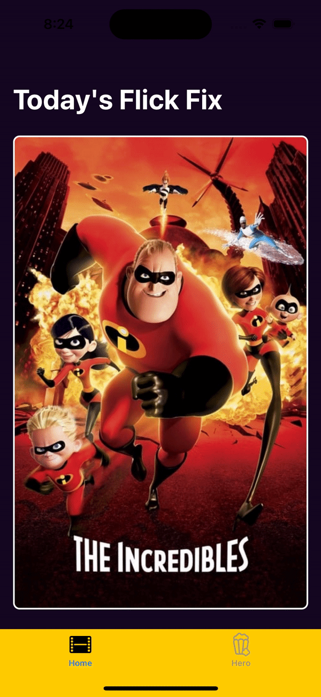

# 
SuperHeroShow

This application follows MVVM software design pattern and is built with [RX swift framework](https://github.com/ReactiveX/RxSwift).

  

## Requirments
- Minimun iOS version: 13.0
- Swift 5.1
- Xcode 14.3

## installation
- Open SuperHeroShowCase.xcodeproj
- Run the project cmd + R.

## Features

- Reactive programing using RxSwift.
- TMDB Movies API.
- Network Image Caching using KingFisher.
- Animation using Hero framework.
- Dependency Injection using swift Inject.
- MVVM

## To Do

- Unit Testing.

# Support
- levivarg@gmail.com
